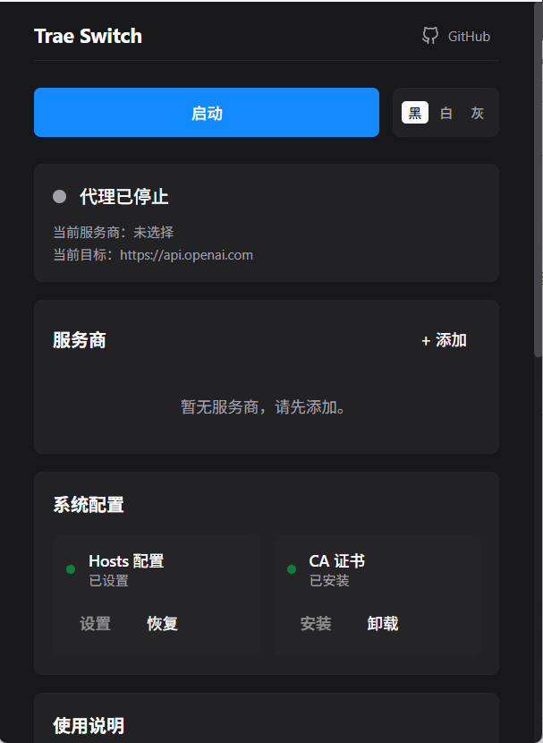
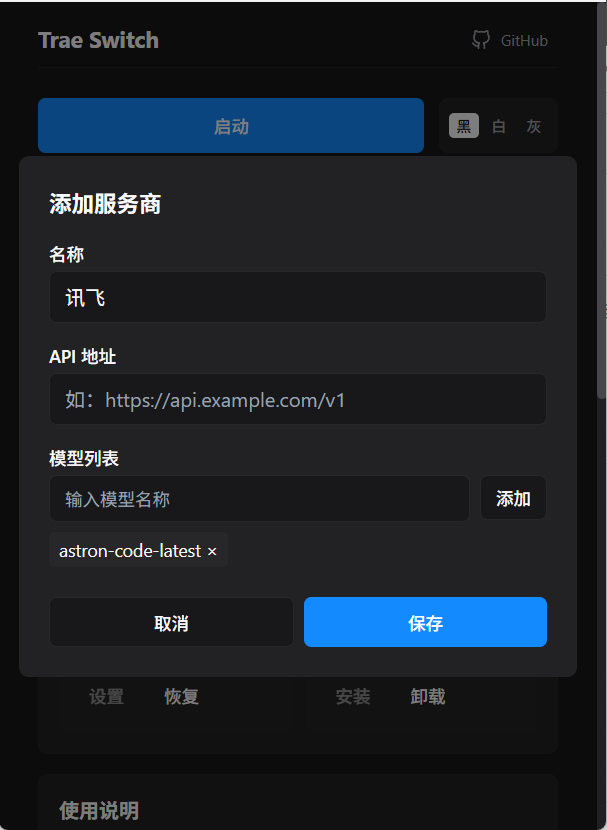
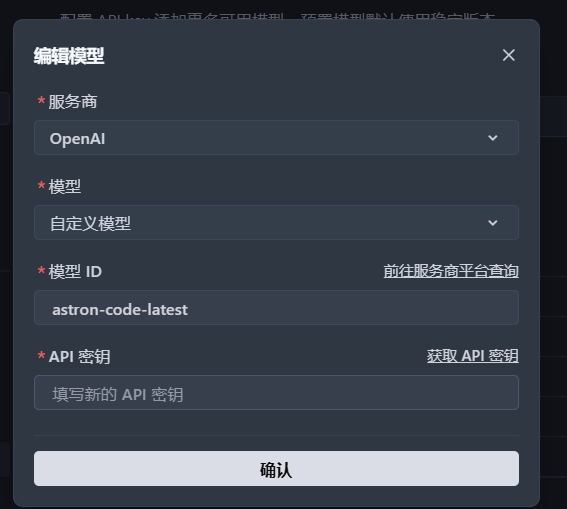
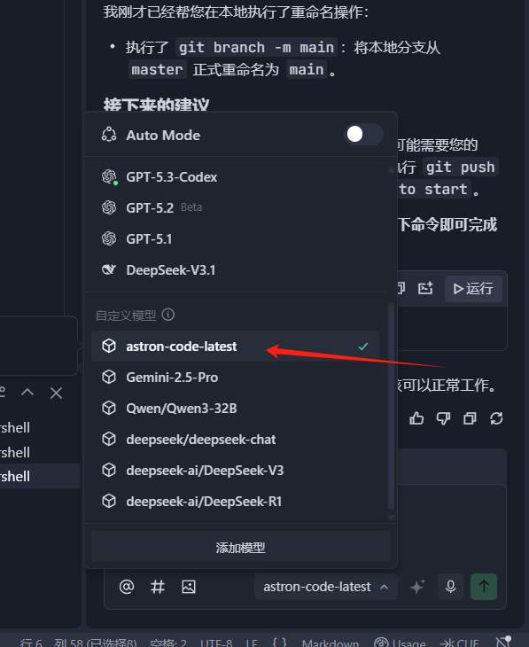
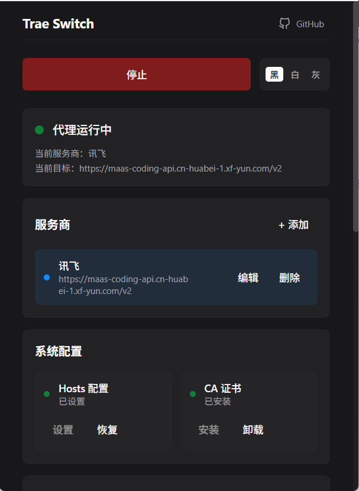

# Trae Switch

**Trae openai Switch 是一个专为 Trae IDE 设计的工具，可以让Trae 接入任何支持 openai 协议的的 第三方模型**，通过 DNS 劫持 + 本地反向代理，让 Trae IDE 支持第三方大模型服务商 API（如阿里百炼 Coding Plan、kimi coding plan等）。详细使用教程：

## 🚀 功能特点

 



- **多服务商支持**：可添加、编辑、删除多个服务商配置
- **本地模型管理**：`/v1/models` 请求返回本地配置的模型（因为第三方通常不支持此接口）
- **自动 Hosts 配置**：将 `api.openai.com` 重定向到 `127.0.0.1`
- **CA 证书管理**：生成并安装本地 CA 证书，用于 HTTPS 拦截
- **实时状态监控**：显示代理运行状态和当前激活的服务商
- **不需要输入key**：通过在trae中配置key，在本工具不需要输入任何apikey
- **智能路径转换**：自动将 `/v1` 请求转换为服务商的实际路径（如 `/v2`）

## 📋 支持的服务商

- ✅ 阿里百炼、Kimi等 Coding Plan
- ✅ 其他支持 OpenAI 协议的第三方api服务商

## 🔧 技术架构

### 技术栈

- **后端**：Go (Wails 框架)
- **前端**：Svelte + Tailwind CSS
- **网络**：HTTPS 代理服务器
- **系统**：Windows 系统集成（Hosts 管理、证书安装）

### 核心模块

1. **代理服务器**：监听 443 端口，处理 OpenAI API 请求
2. **配置管理**：读写 `config.json` 配置文件
3. **Hosts 管理**：自动设置和恢复 Hosts 配置
4. **证书管理**：生成和安装自签名 CA 证书
5. **前端界面**：现代化的用户交互界面

## 📦 安装方法

### 方法一：直接下载可执行文件

1. 从 [Releases](https://github.com/yourusername/trae-switch/releases) 页面下载最新版本的 `trae-switch.exe`
2. 以管理员身份运行程序

### 方法二：从源码构建

#### 环境要求

- **Go**：1.22 或更高版本（推荐 1.23+）
- **Node.js**：16 或更高版本（推荐 18+）
- **Wails CLI**：v2.9.0 或更高版本
- **操作系统**：Windows 10/11（需要管理员权限）

#### 详细构建步骤

**1. 安装 Go 环境**

- 访问 [Go 官方下载页面](https://go.dev/dl/)
- 下载 `go1.24.x.windows-amd64.msi` 并安装
- 验证安装：
  ```powershell
  go version
  # 输出应为 go version go1.22.x 或更高
  ```

**2. 配置 Go 代理（国内用户必做）**

```powershell
go env -w GO111MODULE=on
go env -w GOPROXY=https://goproxy.cn,direct
```

**3. 安装 Node.js**

- 访问 [Node.js 官网](https://nodejs.org/)
- 下载 LTS 版本并安装
- 验证安装：
  ```powershell
  node -v
  npm -v
  ```

**4. 安装 Wails CLI**

```powershell
go install github.com/wailsapp/wails/v2/cmd/wails@latest
```

验证安装：

```powershell
wails version
# 输出应为 v2.x.x
```

**5. 克隆项目并构建**

```powershell
# 克隆仓库
git clone https://github.com/yourusername/trae-switch.git
cd trae-switch

# 安装前端依赖
cd frontend
npm install
cd ..

# 开发模式运行（可选，用于调试）
wails dev

# 正式打包
wails build -clean
```

**6. 获取可执行文件**
构建完成后，可执行文件位于：

```
build/bin/trae-switch.exe
```

#### 开发模式

如果需要在开发过程中实时调试，可以使用：

```powershell
wails dev
```

此命令会启动热更新模式，修改代码后会自动重新编译。

#### 常见构建问题

**Q:** **`wails`** **命令找不到？**

- 确保 Go 的 bin 目录已添加到系统 PATH 环境变量
- 默认路径：`C:\Users\你的用户名\go\bin` 或 `C:\Go\bin`

**Q: 下载依赖超时？**

- 确保已配置国内代理：`go env -w GOPROXY=https://goproxy.cn,direct`

**Q: Go 版本不兼容？**

- 本项目要求 Go 1.22+，请升级 Go 版本

**Q: 前端构建失败？**

- 删除 `frontend/node_modules` 文件夹
- 重新运行 `npm install`

## 🛠️ 使用方法

### 1. 添加服务商配置

1. 点击「+ 添加」按钮
2. 填写服务商信息：
   - **名称**：服务商显示名称（如 "阿里百炼"）
   - **API 地址**：OpenAI 协议的 API 地址（如 `https://coding.dashscope.aliyuncs.com/v1`）
   - **模型列表**：添加可用的模型 ID（如 `qwen3.5-plus`、`kimi-k2.5` 等）
3. 点击「保存」

### 2. 启动代理

1. 确保系统配置中的「Hosts 配置」和「CA 证书」都已启用
2. 点击右上角的「启动」按钮
3. 代理启动成功后，状态栏会显示「运行中」

### 3. 在 Trae IDE 中使用

1. 打开 Trae IDE
2. 进入模型设置
3. 选择 OpenAI 服务商
4. 输入对应第三方服务商的真实 API Key（如 `sk-xxx`）
5. 手动输入你想要使用的模型名称
6. 关闭 auto mode 并选择刚添加的模型
7. 开始使用！

### 4. 路径转换说明（重要）

本工具支持**智能路径转换**，可以自动将 Trae 发送的 `/v1` 请求转换为服务商的实际路径。

#### 使用场景

某些服务商的 API 路径不是 `/v1`，而是 `/v2` 或其他路径。例如：

- 讯飞星火：`https://maas-coding-api.cn-huabei-1.xf-yun.com/v2/chat/completions`
- 其他自定义路径的服务商

#### 配置方法

在添加服务商时，直接在 **API 地址** 中填写完整的路径前缀即可：

| 服务商           | API 地址配置                                            | 请求转换示例                                              |
| ------------- | --------------------------------------------------- | --------------------------------------------------- |
| 标准 `/v1` 接口   | `https://api.example.com/v1`                        | `/v1/chat/completions` → `/v1/chat/completions`     |
| 讯飞星火 `/v2` 接口 | `https://maas-coding-api.cn-huabei-1.xf-yun.com/v2` | `/v1/chat/completions` → `/v2/chat/completions`     |
| 自定义路径         | `https://api.example.com/custom`                    | `/v1/chat/completions` → `/custom/chat/completions` |

**原理**：代理会自动检测您配置的 API 地址中是否包含路径，如果包含，则会将请求中的 `/v1` 替换为该路径。

## ⚙️ 配置文件

配置文件位于程序同目录下的 `config.json`，格式如下：

```json
{
  "providers": [
    {
      "name": "阿里百炼",
      "openai_base": "https://coding.dashscope.aliyuncs.com/v1",
      "models": ["qwen3.5-plus", "qwen3.5-turbo"]
    },
    {
      "name": "讯飞星火",
      "openai_base": "https://maas-coding-api.cn-huabei-1.xf-yun.com/v2",
      "models": ["spark-v3.5", "spark-v4.0"]
    }
  ],
  "active_provider": 0
}
```

- `name`：服务商显示名称
- `openai_base`：OpenAI 协议的 API 地址（支持自定义路径，如 `/v2`）
- `models`：模型 ID 列表
- `active_provider`：当前激活的服务商索引

## 📝 使用说明

1. 添加服务商配置（API 地址和模型列表）并点击「启动」
2. 在 Trae IDE 添加自定义模型，服务商选择 OpenAI 服务商
3. 模型手动输入你想要使用的模型并且输入对应 API Key（如 sk-xxx）
4. 关闭 auto mode 并且选择刚添加的模型

## 🔍 常见问题

### Q: 启动失败怎么办？

**A:** 请检查：

- 是否以管理员身份运行
- 443 端口是否被占用
- Hosts 配置是否成功
- CA 证书是否安装

### Q: 模型不显示怎么办？

**A:** 请确保：

- 已在服务商配置中添加了模型
- 已选择了正确的服务商
- 代理已成功启动

### Q: API Key 如何获取？

**A:** API Key 需要从对应服务商的官方网站获取

### Q: 支持哪些模型？

**A:** 支持所有支持openai接口协议服务商提供的模型，只要在配置中添加对应的模型 ID 即可。

## 🛡️ 安全性

- **本地运行**：所有数据处理都在本地进行，不会上传任何数据
- **自签名证书**：仅用于本地 HTTPS 拦截，不会影响其他应用
- **Hosts 修改**：仅修改 `api.openai.com` 的解析，不影响其他域名
- **不存储key**：通过在trae中配置key，在本工具不需要输入任何key

## 📄 许可证

本项目采用 [MIT 许可证](LICENSE)。

***

## Star History

<a href="https://www.star-history.com/?repos=mtfly%2Ftrae-switch&type=date&legend=top-left">
 <picture>
   <source media="(prefers-color-scheme: dark)" srcset="https://api.star-history.com/image?repos=mtfly/trae-switch&type=date&theme=dark&legend=top-left" />
   <source media="(prefers-color-scheme: light)" srcset="https://api.star-history.com/image?repos=mtfly/trae-switch&type=date&legend=top-left" />
   
 </picture>
</a>
